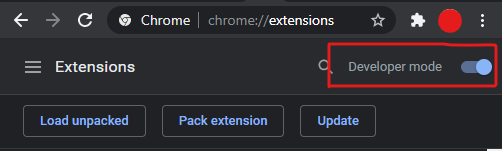
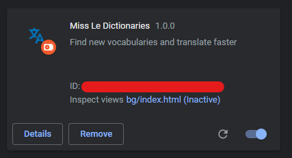
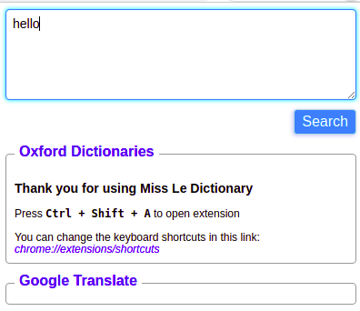

# The Miss_Le_Dicionaty Extension

by Phan Tran Hung

## Overeview

A Chrome Extension let you learn pronunciation and translate English.

More specifically, it use the source from the Oxford for pronunciation and Google Translate for translation.
It useful to find vocabularies very fast

If you want to use the newest features, please use dev branch

_My English not very well, sorry about that._

## Features

- Translate by Oxford Dictionaries
- Auto reader

## Installation

- Download zip file.

- Extract(Unzip) the file to anywhere on your machine.

- Enable [Develop mode.](chrome://extensions/)

- Click on Load unpacked.

- Browse to the place where you save the folder that you unzip before.

- Every done, you will see the icon in top, right of the Chrome window. You can use it now.

## Shortcuts

| Action             | Shortcut                                      |
| ------------------ | :-------------------------------------------- |
| Open the Extension | <kbd>Ctrl</kbd>+<kbd>Shift</kbd>+<kbd>A</kbd> |

_Thankyou for use it_
